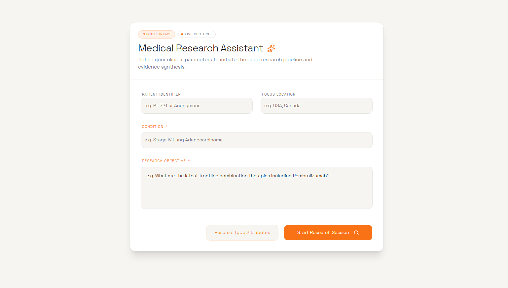

# Curalink — Medical Research Assistant

Curalink is a state-of-the-art medical research assistant designed to streamline clinical workflows and evidence synthesis. By leveraging agentic AI and intelligent retrieval, Curalink transforms raw clinical parameters into structured, actionable insights.

<p align="center">
  
</p>

## ✨ Key Features

- **Intelligent Intake**: Guided clinical parameter definition including patient identifiers, condition context, and research objectives.
- **Deep Research Pipeline**: Automated synthesis of medical literature and clinical trials using advanced RAG (Retrieval-Augmented Generation).
- **Contextual Intelligence**: Intelligent routing between history-aware chat sessions and deep research modules.
- **Premium Interface**: A high-performance, light-themed dashboard built for professional clarity and speed.

## 🛠 Tech Stack

- **Frontend**: React 19, Vite, Tailwind CSS (v4), Framer Motion, Radix UI.
- **Backend**: Node.js, Express, MongoDB.
- **AI Engine**: Groq LPU™ Inference Engine (utilizing Llama-3 models).
- **State Management**: Zustand & TanStack Query.

## 🚀 Getting Started

### Prerequisites

- Node.js (v18+)
- MongoDB instance
- Groq API Key

### Installation

1. **Clone the repository:**
   ```bash
   git clone https://github.com/yourusername/curalink.git
   cd curalink
   ```

2. **Backend Setup:**
   ```bash
   cd backend
   npm install
   # Create .env with MONGO_URI, GROQ_API_KEY, and PORT
   npm run dev
   ```

3. **Frontend Setup:**
   ```bash
   cd frontend
   npm install
   npm run dev
   ```

## 📄 License

This project is licensed under the MIT License.
